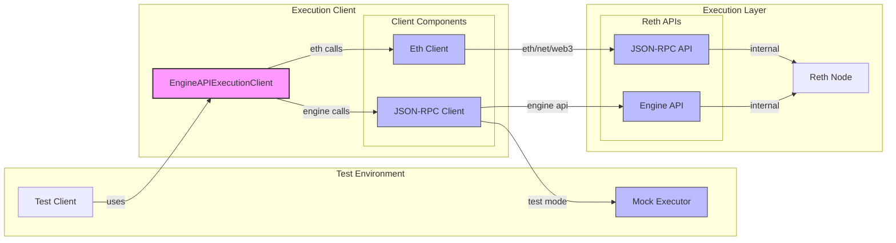

## Architecture



The architecture consists of several key components:

1. **Execution Client**

   - `EngineAPIExecutionClient`: Main client interface that implements the Execute interface
   - `EthClient`: Handles standard Ethereum JSON-RPC calls
   - `JsonRpcClient`: Handles Engine API calls

2. **Execution Layer**

   - `Reth Node`: Ethereum execution client
   - Exposes Engine API and standard JSON-RPC endpoints

3. **Test Environment**
   - `Test Client`: Integration tests
   - `Mock Executor`: Simulates execution behavior for unit tests

## Development

```bash
$ cd docker
$ docker compose up -d
$ docker compose down
```
